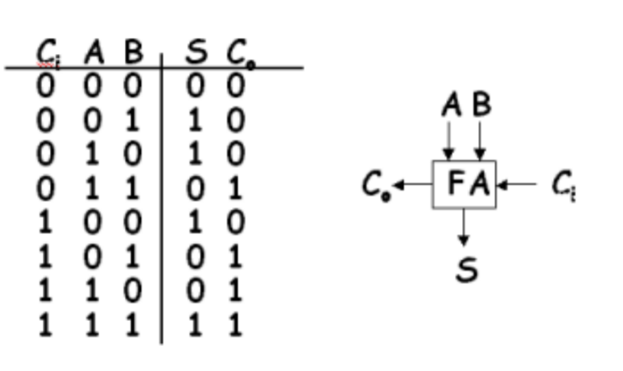

# SW Lab 2

In this lab made a full bit adder out of CMOS circuits, and combined it with three other adders using the ripple-carry architecture to form a four bit adder. Started off the design by connecting individual MOSFETS with the adder equation that we derived and combining them to form a CMOS circuit

## Adder Schematic and truth table

## Adder Results

