## SW Lab3 

Probably worst lab ever but great team mate (and friends who finished it too fast, too early) that helped me with the multiplier section.

The alu design is made out of 4 components, an adder(bonus multiplier), a comparer, a boolean operator, and a bit shifter. Images below show the code for setting up the components on a platform called JSim(Java Simulation), the individual expected output from passing input through the components, and the final combined ALU. (multiplier not included 'cos too long :/)

### Presenting the ALU

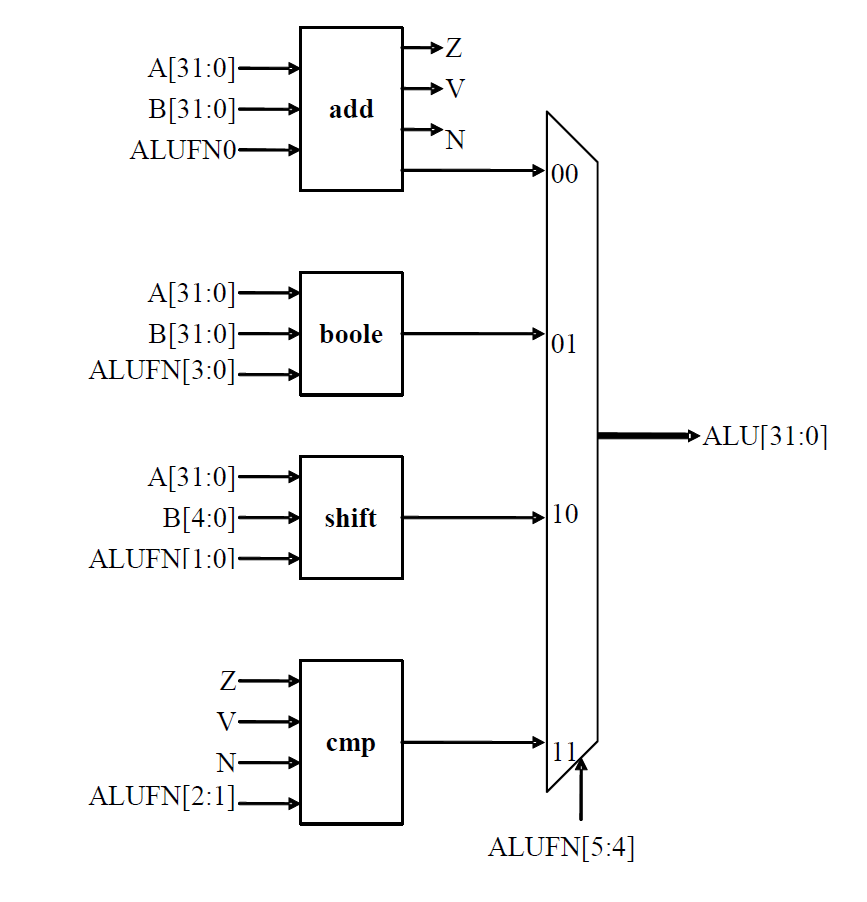

<b>Adder</b>

Schematic for adder

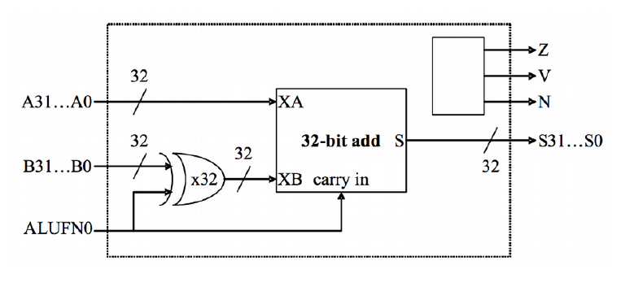

Code for adder

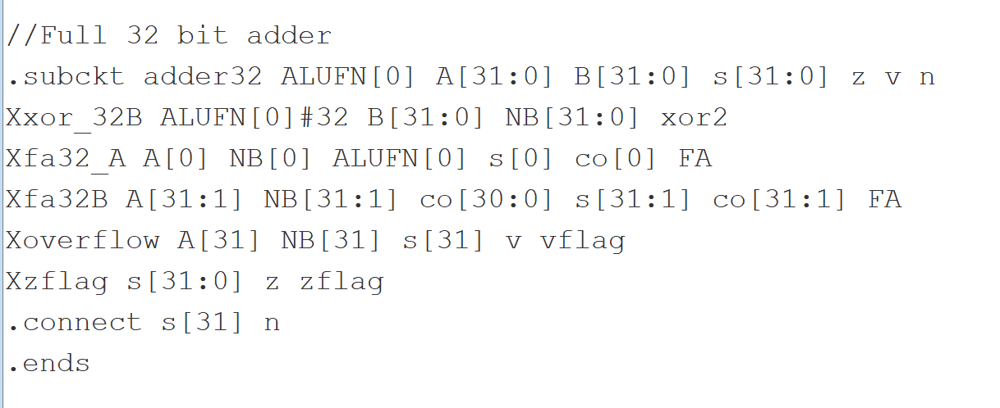

Results for adder

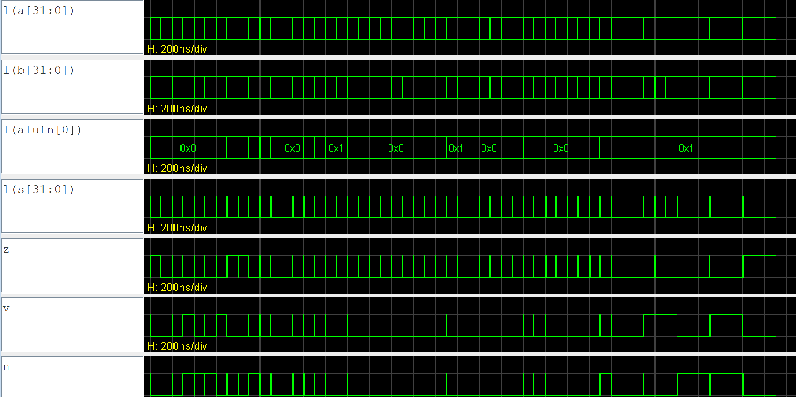

<b>Compare</b>

Logic for compare

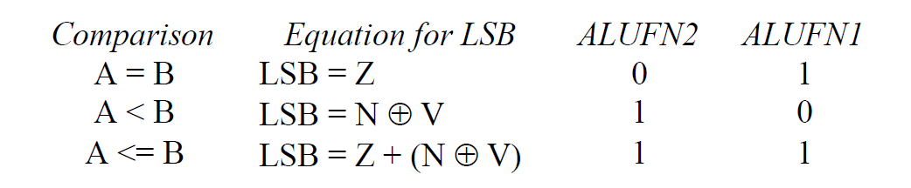

Code for compare

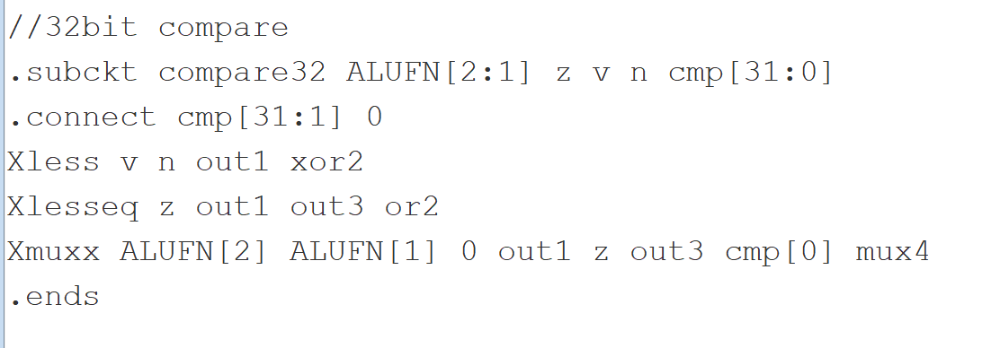

Results for compare

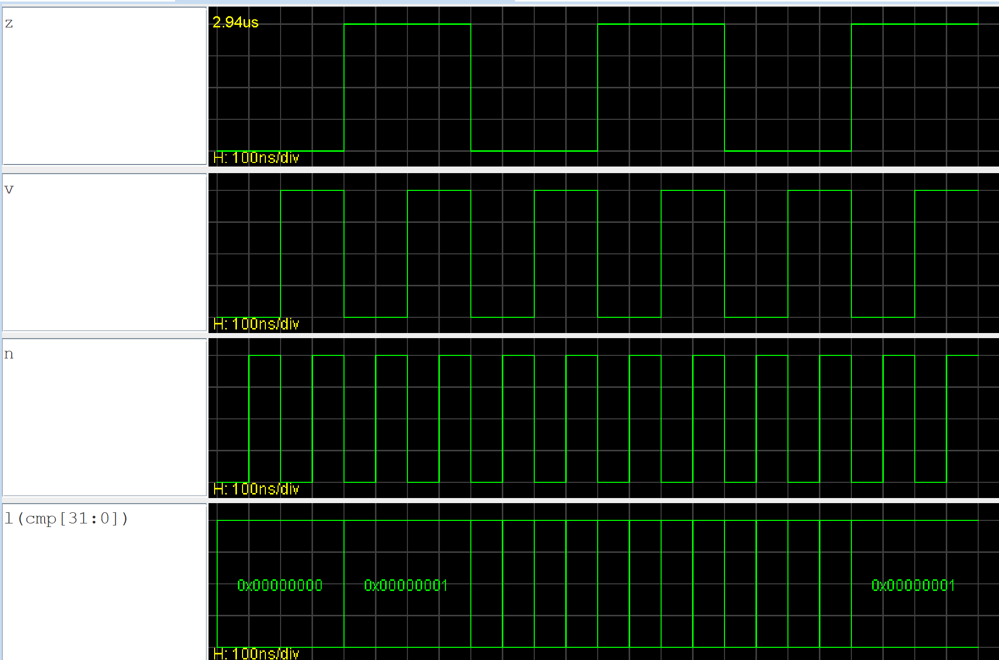

<b>Boolean</b>

Schematic for boolean

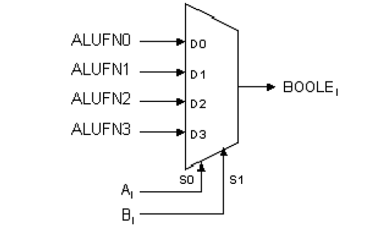

Code for boolean

Results for boolean

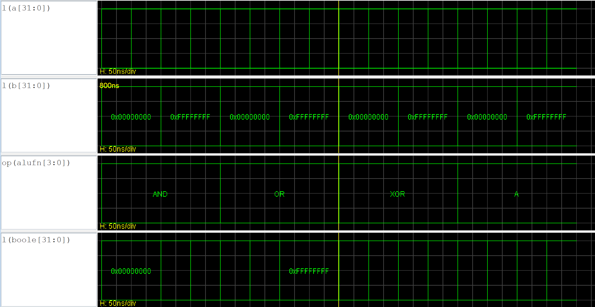

<b>Shifter</b>

Schematic for shifter

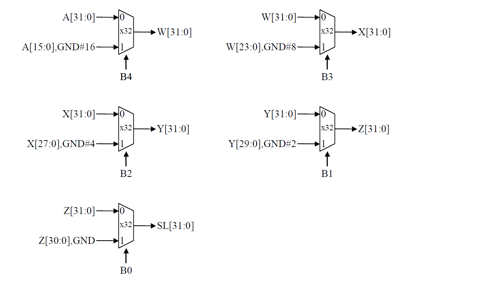

Code for shifter (1)

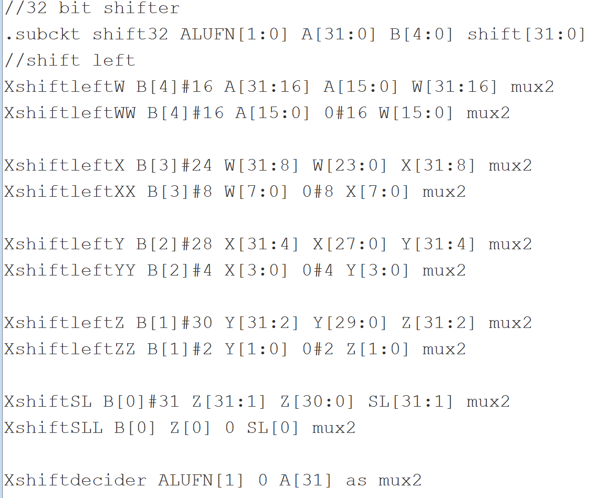

Code for shifter (1)

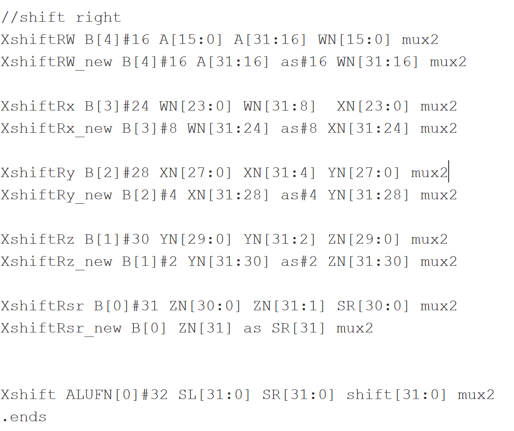

Results for shifter

<b>Multiplier</b>

Schematic for mutliplier

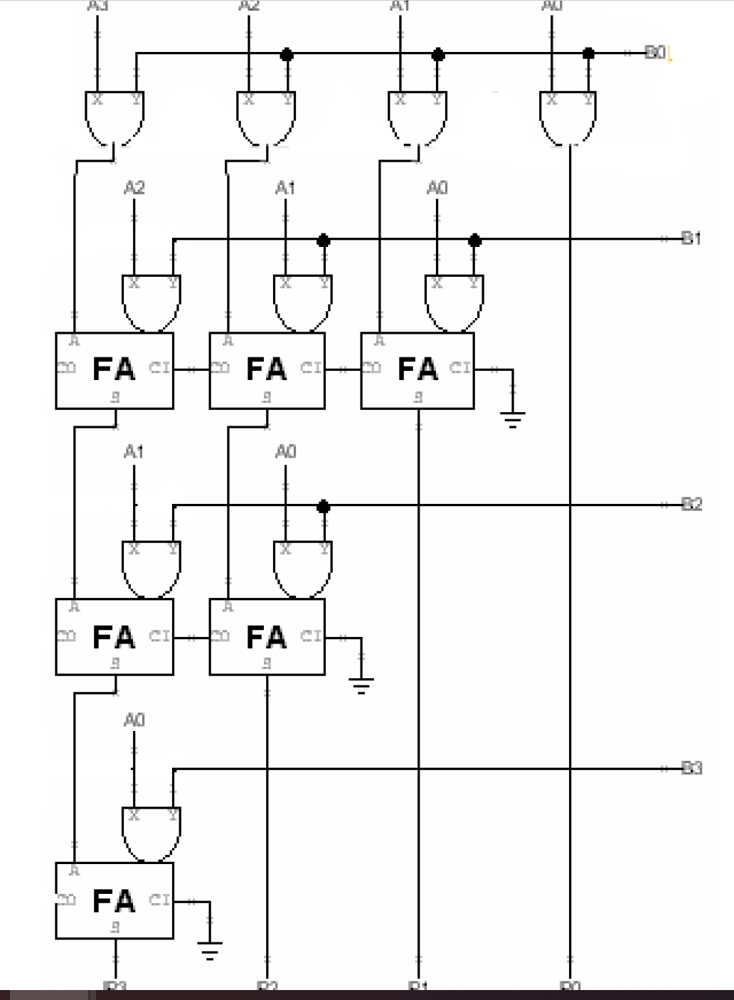

Results for alu with multiplier

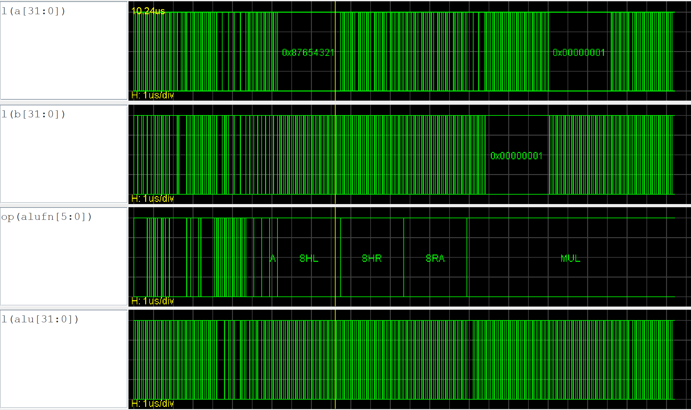

P.S. to current term 4 peeps, please do not reference directly from the code but use the worksheet provided to get a rough idea of how it works/ask your friends to explain. This is intended as a way to compile my work for keepsake :)
