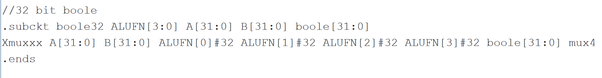
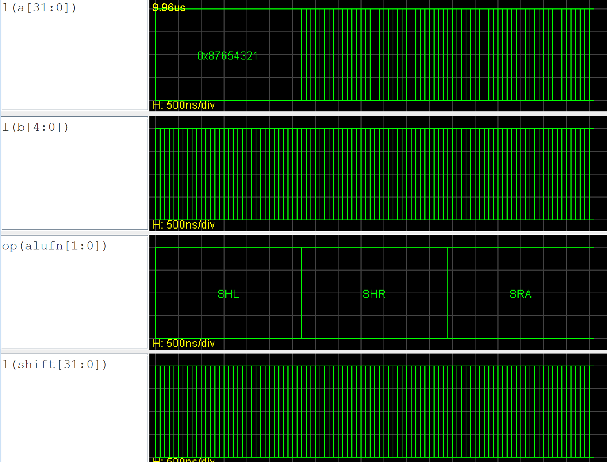

## SW Lab3 

Probably worst lab ever but great team mate (and friends who finished it too fast, too early) that helped me with the multiplier section.

The alu design is made out of 4 components, an adder(bonus multiplier), a comparer, a boolean operator, and a bit shifter. Images below show the code for setting up the components on a platform called JSim(Java Simulation), the individual expected output from passing input through the components, and the final combined ALU. (multiplier not included 'cos too long :/)

P.S. to current term 4 peeps, please do not reference directly from the code but use the worksheet provided to get a rough idea of how it works/ask your friends to explain. This is intended as a way to compile my work for keepsake :)

### Presenting the ALU

#### Adder

Schematic for adder

Code for adder

Results for adder

#### Compare

Logic for compare

Code for compare

Results for compare

#### Boolean

Schematic for boolean

Code for boolean

Results for boolean

#### Shifter

Schematic for shifter

Code for shifter (1)

Code for shifter (1)

Results for shifter

#### Multiplier

Schematic for mutliplier

Results for alu with multiplier

